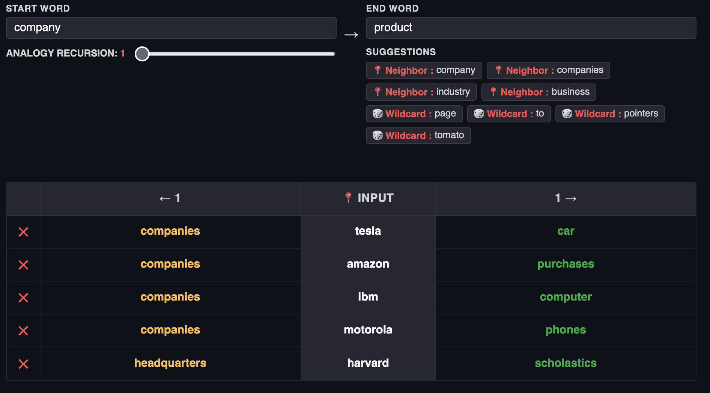
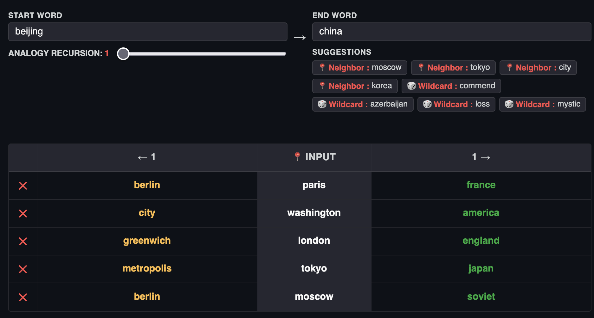

# Word Algebra

An edge compute word-vector based analogy calculator, running in the browser.

Basically, it takes word vectors, and illustrates how the difference between the two roughly corresponds with concepts.

EG : Let V(w) -> v be a function which calculates a vector v for the word w. 

Let V(woman) - V(man) = v3 . We should expect that V(king) + v3 ≈ V(queen).

The "algebra" is done entirely in the browser, with a cache of around 8000 words and vectors loaded locally in the browser, 15 MB compressed, 60 MB uncompressed.

The server itself does minimal work, acting as a look up table of vectors for 400,000+ less commonly used words. This is so you can type in any word as an input, but the output is limited to the 8000 locally stored words. If you lose connection, as long as the /api/matrix file is loaded, the web page can act independently, but the input would then be limited to 8000 words instead of all 400,000+ words.

[Read this for an Architectural Breakdown of how the Application works.](./Word Algebra Architecture.md)

## How to Run
### TL;DR
- `git clone https://github.com/karans4/Word-Algebra.git`
- `cd Word-Algebra`
- `bash first_run.sh`
- `source venv/bin/activate && python app.py`

### Not TL;DR
- Make sure you have python3, pip, and venv installed.
- Navigate in the terminal to the directory you downloaded this file in
- Run first_run.sh, This should set everything up for you, and if it works, then skip to step 8.
- Create a venv with `python3 -m venv venv`
- If you are not in the venv, make sure you do `source ./venv/in/activate`
- Install the requirements with `pip install -r requirements.txt`, also install `gunicorn` on production
- Run `python setup.py` to initialize the vectors (may take 20 to 40 min to run)
- You can either run `flask --app app.py run` when testing, or `gunicorn --workers 4 app:app --preload --bind 0.0.0.0:5000` on production servers.
	* If you do preload, you might want to set embeddings.npy to read only with `chmod 444 embeddings.npy` to save memory.
	
	
	
## Tips
* You may want to use cloudflare or a CDN for caching. It brings the bandwidth and load on the server to a fraction of a percent what it would be otherwise.
* You can delete the *.npx, *.json, and *vocab*.txt files, and run `python setup.py` to regenerate them, but the words chosen for the output matrix depend on your CPU type, python version, library implementations, etc. If you want consistency, stick with the generated files.

