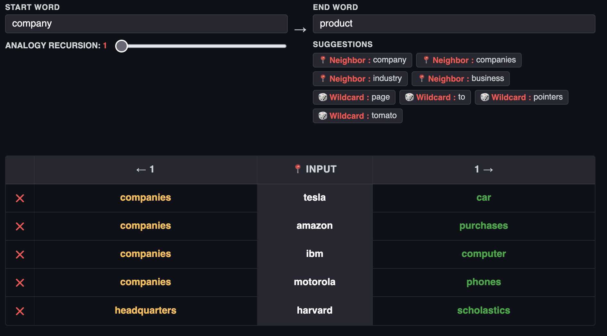
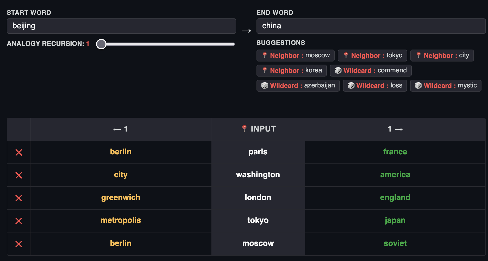

# Word Algebra




**Word Algebra** is a browser-resident inference engine that executes real-time vector arithmetic on the edge. By shifting high-dimensional nearest-neighbor searches from the server to the client, the system achieves sub-millisecond inference speeds and full offline capability.

[**Live Demo**](https://notruefireman.org/word_algebra) | [**Architectural Deep Dive**](https://github.com/karans4/Word-Algebra/blob/main/Word%20Algebra%20Architecture.md)

---

## 🚀 The Core Concept: Semantic Vector Math

The engine treats words as points in a high-dimensional manifold. By calculating the displacement between two word-vectors, we can "extract" a semantic relationship and apply it to a new base word.

$$V(\text{king}) - V(\text{man}) + V(\text{woman}) \approx V(\text{queen})$$


The "algebra" is performed entirely in the browser using a high-density cache of ~8,000 common words and their corresponding vectors.

---

## 🛠 Engineering & Optimization Highlights

To make 400k+ high-dimensional vectors usable in a standard browser environment without massive server overhead, I implemented several key optimizations:

### 1. "Fat Client" Hybrid Architecture
Traditional AI applications rely on heavy API calls for every computation. This project uses a hybrid compute model:
* **Edge (Browser):** Houses a compressed **15MB local cache** (60MB uncompressed) of the top 8,000 words. This allows for instant, offline "analogy-to-vector" calculations and nearest-neighbor lookups.
* **Server (Backend):** Acts as a lightweight, high-speed lookup table for the "long-tail" (400,000+ words). If the user inputs an obscure word, the server retrieves only that specific vector, while the final search remains client-side.

### 2. High-Density Data Compression
* **Latency Management:** The 15MB payload is optimized for delivery via CDN. By utilizing Gzip/Brotli at the edge (Cloudflare), the initial "cold start" for the entire inference engine is reduced to a single asynchronous fetch.
* **Offline Capability:** Once `/api/matrix` is loaded, the application is fully functional without an internet connection for any inputs within the 8k-word local vocabulary.

### 3. Production-Grade Memory Optimization
The Flask backend is designed to handle the 400k word matrix efficiently on low-resource VPS environments:
* **Memory Mapping ($mmap$):** Uses `embeddings.npy` in $mmap$ mode to allow the OS to manage memory paging efficiently.
* **Process Preloading:** Gunicorn is configured with the `--preload` flag to share the embedding matrix memory across all worker processes, significantly reducing the RAM footprint.

---

## 💻 Tech Stack
* **Inference/Math:** NumPy, Scikit-learn (Preprocessing), Vanilla JS (Client-side)
* **Backend:** Python, Flask, Gunicorn
* **Infrastructure:** Debian/Red Hat, Cloudflare CDN

---

## 🛠 Installation & Deployment

### Quick Start (Development)
```bash
git clone [https://github.com/karans4/Word-Algebra.git](https://github.com/karans4/Word-Algebra.git)
cd Word-Algebra
bash first_run.sh
source venv/bin/activate && python app.py
```

### Manual Setup (Production)
1.  **Environment Setup:**
    ```bash
    python3 -m venv venv
    source ./venv/bin/activate
    pip install -r requirements.txt gunicorn
    ```
2.  **Initialize Embeddings:** Generate the vectorized lookup files (this can take 20–40 minutes depending on hardware).
    ```bash
    python setup.py
    ```
3.  **Production Deployment:**
    Use Gunicorn with preloading to optimize shared memory:
    ```bash
    gunicorn --workers 4 app:app --preload --bind 0.0.0.0:5000
    ```
    *Tip: Set `chmod 444 embeddings.npy` to ensure the matrix is read-only for shared memory safety.*

---

## 📈 Performance & Scaling Tips
* **CDN Strategy:** Using a CDN like Cloudflare is highly recommended. Because the `/api/matrix` file is static, edge caching reduces server bandwidth and CPU load by over 99%.
* **Deterministic Weights:** The vocabulary matrix generation is deterministic based on the CPU architecture and library implementation. For consistent results across a distributed cluster, generate the `*.npx` and `*.json` files once and distribute them as static assets.
