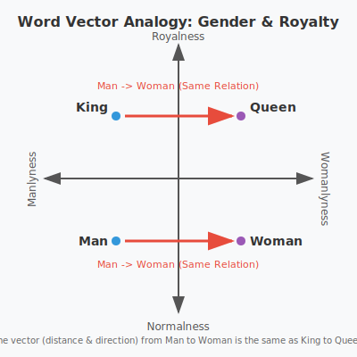

# Word Algebra: An Architectural breakdown

I had very recently become interested in the foundations of LLMs and how they work, so I decided to do a little reading. There was, of course, the mother of all LLM research papers, [Attention is all you need](https://proceedings.neurips.cc/paper_files/paper/2017/file/3f5ee243547dee91fbd053c1c4a845aa-Paper.pdf), and so I was naturally drawn to reading that first.

I'll be completely honest. Going head-first into the paper left me completely lost; I had no idea what it was talking about. I took a detour and watched some of [3Blue1Brown's videos on the topic](https://www.youtube.com/watch?v=LPZh9BOjkQs&list=PLZHQObOWTQDNU6R1_67000Dx_ZCJB-3pi&index=5), and read some more foundational papers on AI in general. After brushing up on some of my [linear algebra](https://linear.axler.net/) and remembering what I could from my one optimization class I took in college, I was able to slowly parse some of the contents of the paper. What I saw in there completely changed my view of the world, AI, LLMs, and what it means for someone or something to "understand", but that's a topic for another day.

## The concept behind the application

3Blue1Brown talks about Word Vectors in his videos, but as a very short recap, when you are training a model, it has to have a certain understanding of words, their meaning, and what context they are used in. After being trained on a large corpus of words, every word has a vector associated with it. Let's look at a simple example of a 2D space with 4 words: King, Queen, Man, and Woman. Let's look how they would be arranged on a graph. 

As we can see, the distance and direction between Man and Woman on the graph is very similar to the distance between King and Queen. That's because King and Queen are used in similar contexts in many contexts (like rulers of a country, or important chess pieces), but are used in different contexts when it comes to issues of gender. A neat property about some training methods is that you can illustrate the semantic differences using simple vector arithmatic. For example, Vector("Woman") - Vector("Man") = Vector("Queen") - Vector("King"). I hope you can see from the diagram above how that relation holds.

In real life, we are using way more than 2 dimensions (my application used 384), and each axis won't be laid out with such an easy to understand concept like royalty, but the principle still holds.

## The alpha and beta stages

I wanted an excuse to try out Google's new Gemini model, so I made extensive use of it during this project. It was amazing at first, but you run into the same problems as you do with any LLM eventually (ignoring instructions for what it thinks is better, strange aesthetic choices, an inability to check its own work, confusing who said what), but overall, I'm very impressed as long as you don't use fast mode.

Originally, I was going to implement this application in a pretty straight-forward way. I would be running a model that would encode a start word (e.g Man) and a target word (e.g. Woman) into a vector, add the difference to a new word (e.g. King) compare it to the precalculated vectors of over 400,000 words to get the closest comparison (e.g. Queen). It could use subtokenization to turn any word (even words never seen before like "unobtanium") into a vector by breaking it up into its parts ("un" + "obtain" + "ium"), and the outputs would be nice and varied in a 400k dictionary. The client would do very little but ask for the relations between words, and the server would do all the heavy lifting.

This would be the general way it worked:

* The user would type in two words, (e.g. "Man", "Woman"), and some other words to compare it to, "King", "Actor".
* The client would ask the server to calculate these relations.
* The server would spin up model "all-MiniLM-L6-v2" to calculate the vectors for these words and do the math. Vector("Woman") - Vector("Man") + Vector("King"), Vector("Woman") - Vector("Man") + Vector("Actor").
* It would compare the new vectors to a dictionary of 400k words and their vectors (precomputed) to see what was closest. ≈ Vector("Queen"), Vector("Actress")
* It would send the words back to the client. "Queen", "Actress"

This works, but it took around 100 ms per relation on my shiny new-ish M2 Mac. I couldn't imagine how slow it would be on a Debian VPS serving multiple people that I refused to fork over any real money for.

### The first breakthrough: An output Dictionary

Rather than comparing the newly calculated vector to all 400K words, I could choose the 5000 most common words. This speeds up each response to around 30ms. The only issue is that you end up with 100 different ways of saying puppy, and no words are left to talk about anything else.

To fix this, I settled on chosing a "conceptually diverse" selection of 5k to 10k words. My idea of conceptually diverse was 5000 words whose vectors were as far apart as possible from each other. In practice, it would use the K-Means clustering algorithm to chose these words, making them as far apart from each other as reasonably possible.

This approach runs into a problem very quickly though. Language isn't about expressing the mathematically most diverse concepts. It's about words people actually need to use. Knives and Swords are very similar concepts in the grand scheme of things, but having words for both is an important distiction that we need to make, even if it doesn't show up on any top 5k word list.

This whole time, I felt that I was running into unexplored linguistics territory, but this was the compromise I settled upon. Various people over the years have come up with lists of essential concepts. I aggregated four specific datasets to create my "Essential Vocabulary" list. The first three come from the field of linguistics:

* **Dolch Nouns**: The 95 nouns that make up the majority of children's reading books. These should be the baby basics of ideas, like "apple", "farmer", "sister", "shoe"
* **The Swadesh List**: A classic linguistic list of 207 "universal" concepts found in almost every human language (concepts like "die," "sun," and "mother").
* **Ogden’s Basic English**: 850 words designed to simplify international communication in trade.

They seemed to cover a lot of ground, but I still found them lacking. I eventually settled on a fourth list that made the dataset feel complete.

* **The Soul List**: 1300 words designed to cover civilisational architypes, Divided into 5 broad catagories:
    * Hierarchy, Roles & People (Gender & Status Pairs)
    * Dualities, States & Qualities (Time & Age, Physical Dimension, Condition, Abstract / Moral)
    * War, Politics & Structure (Roles, Institutions & Places, Actions & Concepts,  Combat Equipment)
    * Cosmos, Elements & Nature
    * Objects, Tools & Technology

Although I wish there was an authorative source for "The Soul List", nothing like that really seemed to exist, so I had Gemini fill it out.

I increased the output dictionary word count to 8000, and used K-Means clustering to "fill in the gaps" of the output vocabulary.

### The second breakthrough: Precomputing and Caching Everything

Now that I had settled on about 8k words that I had deemed as essential, I realized that I had this giant list of 400k words left over. I also had their vectors precalculated. I decided to use this as an input list, and to reject all words outside of this list. Since every vector was precalculated, I wouldn't need to spin up the model and encode a word on each request, and I could just look up the vector associated with each word. Also, I would be able to reject random spam like "www.scamwebsite.com", since that wouldn't be in my input dictionary.

I would be losing out on being able to encode any word into a vector, even words I had never seen before like hyperultramegaunobtanium, but that was a sacrifice I was willing to make. 400k words ought to be enough for anybody.

I was able to get the response time on my Macbook down to 18 ms with this.

As a general heuristic, the server was about 1/6th as good as my Macbook, so this made me feel very hopeful about reaching close to what I would consider acceptable performance.

I also added code to the client to cache as much as possible to avoid calling the server more than necessary.

### The final breakthrough: Cloudflare

Okay, I know this sounds like an ad, but it's not. Since my entire application was now deterministic and precomputed, there was very little room for me to improve on the server side. The performance wasn't quite where I needed in to be for this to be something I could really run on my VPS, so I decided to do the last logical thing, shift everything to the client.

I have a list of 400,000 word and their vectors that can be used as an input, and I have a list of 8000 words and their vectors that can be the output. The 400k input list is massive, around 600MB when loaded into memory. I can't send that to a browser; it would crash a mobile phone instantly. But the output list? It's around 60 MB, but when compressed it's closer to 10 MB.

That’s smaller than the into animation on many startup landing pages.

I realized I could split the architecture down the middle:

1. The Server keeps the massive 400k input dictionary. It becomes a simple "Librarian." You give it a word, it gives you the vector. It does zero math.
2. The Client downloads the 10MB output matrix once. It becomes the "Calculator." It performs the vector addition, subtraction, and the cosine similarity search against those 8,000 concepts directly in JavaScript.

Since the output matrix is static, I can use cloudflare to cache it. This brings my bandwidth costs down to nearly 0, and the only requests made to my server are trivial API calls.

## The End Architecture

The final stack is a "Hybrid Edge-Compute" model that runs on a budget of roughly $5/month, yet scales almost infinitely.

### 1. The "Dumb" Librarian

I deployed a simple Python/Flask container on a cheap VPS. Its only job is to hold the 400,000-word input map in memory.

* **Request:** `GET /api/vector?word=obtain`
* **Action:** Look up ID -> Fetch Array -> Return JSON.
* **Cost:** Negligible CPU. It’s an `O(1)` hash map lookup.

### 2. The Distributor (Cloudflare)

The 10MB output matrix is static. It doesn't change unless I update my "Soul List" or "Essential Vocabulary." I configured the server to send a `Cache-Control: public, max-age=3600` header.

* Cloudflare picks up this file and caches it at the edge.
* When a user in Tokyo loads the site, they download the matrix from a Tokyo data center, not my server in the USA.
* **Bandwidth Cost:** Effectively zero.

### 3. The Brain (The Browser)

This is where the magic happens. Using JavaScript's `Float32Array`, modern browsers are shockingly fast at linear algebra.

* The client downloads the matrix and caches it.
* When the user types `King - Man + Woman`, the browser fetches the three vectors from the server (or its local cache), does the math, and runs a dot product against the 8,000 local vectors.

## Conclusion

We often reach for the heaviest tools like Kubernetes, Celery queues, massive GPU instances because that's what the "State of the Art" papers use. But by respecting the constraints of a cheap VPS and leveraging the incredible power of modern browsers, I built something that feels instant, costs pennies, and taught me that sometimes, the best way to scale a server is to make sure it does absolutely nothing at all.